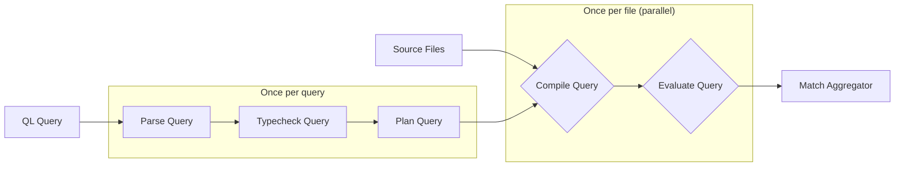

`ql-grep` is a code search tool that evaluates CodeQL queries on source code using tree-sitter as a parser.  Internally, `ql-grep` is structured as shown in this diagram:



Note that, as indicated in the diagram, the parsing, type checking, and planning phases occur once per query.  The query compilation and evaluation phases occur once per source file processed.

# Parse Query

Queries can be specified either as literals on the command line or in files.  `ql-grep` parses queries using the [tree-sitter grammar for CodeQL](https://github.com/tree-sitter/tree-sitter-ql).  After obtaining a concrete parse tree from tree-sitter, `ql-grep` constructs in the `parse_query_ast` function (see `[ref:codeql-query-parser]`).  See the `Expr` and `Query` types.  Note that the parsing and type checking phases of `ql-grep` share the same AST, with the phases tracked by a phantom type parameter.

Note that the query parsing does not take advantage of any tree-sitter capabilities; it was merely expedient to use an existing grammar to accelerate development.  It would be nice to have a custom CodeQL parser for two reasons:

1. It would let us avoid the submodule dependency since this grammar is not on crates.io
2. It would let us give better error messages

Note that, particularly for file-based queries, the tree-sitter grammar is slightly problematic.  It includes nodes for comments, which makes `ql-grep`'s AST traversal a bit fragile.

# Typecheck Query

The type checking pass (see `[ref:typechecking-pass]`) in `ql-grep` is fairly standard.  As a byproduct, it populates each `Expr` node with a `Type`.  The most notable aspect of the type checking implementation is that it is entirely data-driven based on `library.kdl`, which is the canonical list of supported objects, methods, and their type signatures.

At both test time and run-time, `ql-grep` ensures that the contents of `library.kdl` match the set of supported CodeQL primitives.

# Plan Query

The query planning phase performs static query rewrites.  While this could include optimizations in the future, it currently normalizes queries into a form that is easier to compile.  In particular, it translates complex relational transformations into forms with explicit binders.  This enables query compilation to be uniform and simple.  As an example, a query term like `f.foo().bar().baz()` where `f.foo()` is relational (i.e., generates multiple values) would be rewritten to:

```
Bind(fresh, f.foo(), fresh.bar().baz())
```

which is then compiled into a suitable looping construct.

# Compile Query

The query compilation process is applied once per source file analyzed.  It is a straightforward translation of the query IR into a DAG of Rust closures that invoke each other.  Roughly speaking, there is one function per query IR node.  Because the query can be a DAG, each closure is wrapped in a `Rc`.

Note that compilation is language-specific, as CodeQL constructs are ultimately translated into queries against the tree-sitter AST for each source file.  The differences between languages are "abstracted" over in the `TreeInterface` type, which is instantiated for each supported programming language.  Abstracted is in quotes because the abstraction is not good or principled; it is merely sufficient to compile queries uniformly.

Each CodeQL predicate is also translated in the `QualifiedAccess` case of the compiler, which looks up handlers for each supported predicate.  The construction of the map from predicate names to handlers is done once (lazily) per run of `ql-grep`; that process includes a check that:

1. All of the predicates that library.kdl claims are supported have an implementation defined at run-time
2. All predicates that are supported at run-time are declared in library.kdl

See `[ref:method_impls_map]` for details.

The recompilation is sub-optimal, however it is a sufficiently fast process that it has not been problematic so far.  There is also a chance that a refactoring to enable sharing compiled artifacts between threads could make execution slower (e.g., switching from `Rc` to `Arc` could introduce extra memory synchronization between threads).

# Evaluate Query

The final major step in a `ql-grep` execution is query evaluation.  Due to the representation of compiled queries as closures, query evaluation is simply invoking the outermost closure, which forces the evaluation of the entire query.

Note that there is also a bit of logic in the evaluator to do any necessary preprocessing/indexing before queries can be evaluated.
